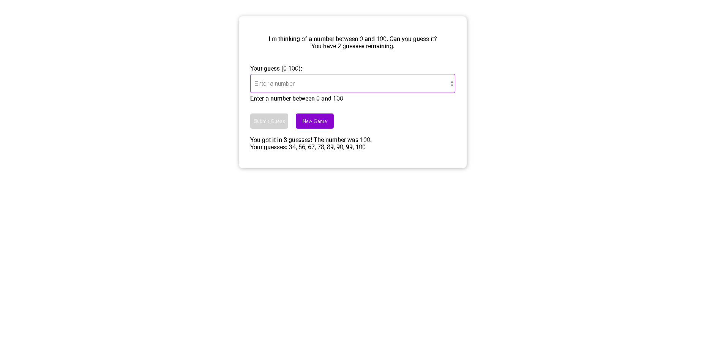

# 🎯 Guess the Number Game

A simple browser-based **number guessing game** built with HTML, CSS, and JavaScript.

## 🚀 Features
- Random number between **0 and 100**
- **10 attempts** to guess correctly
- Feedback after each guess:  
  - "Too high"  
  - "Too low"  
  - "You got it!" 🎉
- Tracks and displays all your previous guesses
- **New Game** button resets everything

## 🖥️ Tech Stack
- **HTML5**
- **CSS3** (Roboto font, hover effects, responsive styling)
- **Vanilla JavaScript** (DOM manipulation & game logic)

## 📷 Screenshot
 <!-- you can add your own screenshot later -->

## ⚡ How to Play
1. Enter a number between **0 and 100**.
2. Click **Submit Guess** (or press Enter).
3. See hints if your guess is too high or too low.
4. Try to guess within **10 attempts**.
5. Click **New Game** to play again.

## 🛠️ Setup
Clone this repository:
```sh
git clone https://github.com/your-username/guess-the-number.git
